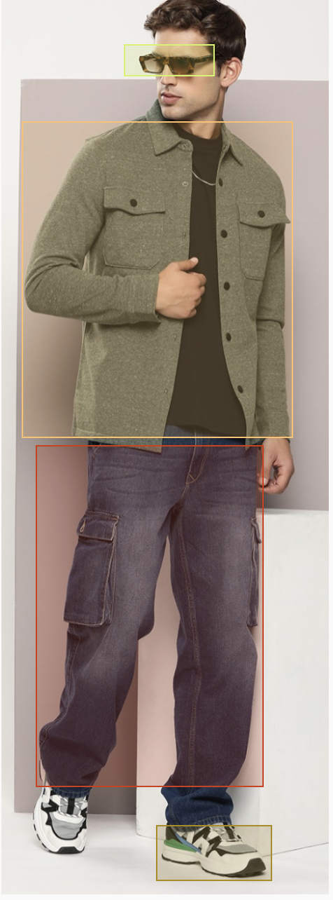
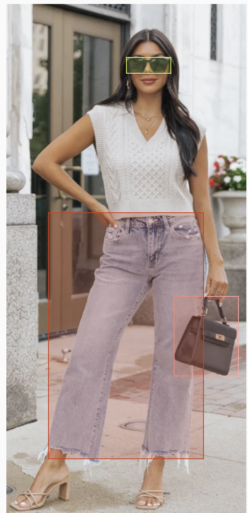
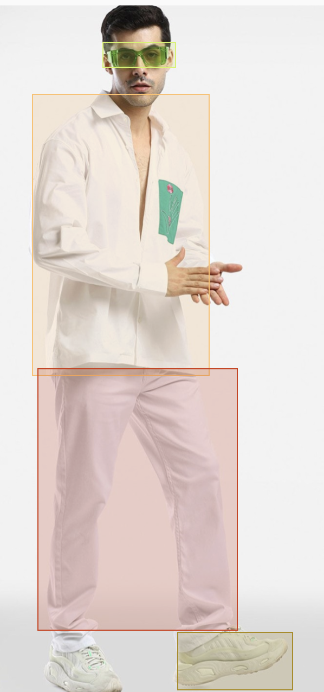
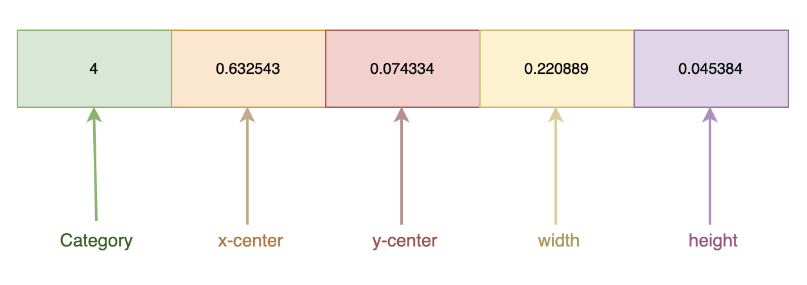

# Shop The Look  with Agentic RAG 

## Milestone 1: Custom Object Detection with YOLO on Fashion Accessories

This section describes an  object detection pipeline using the YOLOv5 architecture. It includes steps like data annotation, model training, evaluation, and inference. YOLOv5 is an object detection model that balances accuracy and speed, making it ideal for real-world applications.

## What is Object Detection?

Object detection is a fundamental task in computer vision where the goal is to not only classify objects in an image but also to **locate them** with bounding boxes. Unlike image classification which gives a single label for an entire image, object detection can identify **multiple objects** and return both:

- The class of each object (e.g., "car", "person")
- The location of the object in the form of bounding box coordinates

This technology helps in real-world applications such as:

- **Autonomous vehicles** (detecting pedestrians, traffic lights)
- **Surveillance systems** (detecting intrusions or abnormal behavior)
- **Retail analytics** (monitoring customer behavior)
- **Healthcare diagnostics** (detecting tumors or anomalies in scans)

<center>
  
</center>

## How Object Detection Works

At its core, object detection is a combination of **localization and classification**. Here's how the process generally works:

1. **Input Image**: The raw image is passed to the model.
2. **Feature Extraction**: A convolutional neural network (CNN) is used to extract spatial features.
3. **Region Proposal / Grid Mapping**: The model either proposes regions of interest (in two-stage detectors) or uses fixed grids (in single-stage detectors like YOLO).
4. **Bounding Box Regression**: For each region/grid, the model predicts coordinates for bounding boxes.
5. **Object Classification**: Each box is classified to determine which object it contains.
6. **Post-processing**: Non-Max Suppression (NMS) removes duplicate boxes and retains the most confident detections.

The output is a set of bounding boxes, class labels, and confidence scores.


## Common Object Detection Algorithms

Over time, object detection algorithms have evolved from traditional methods to deep learning-based models. They are broadly categorized as:

### Two-Stage Detectors
These models first generate region proposals and then classify them.
- **R-CNN (2014)**: Extracts features for each region using CNNs.
- **Fast R-CNN**: Improves speed by using a single CNN feature map for the whole image.
- **Faster R-CNN**: Introduces Region Proposal Networks (RPN) for end-to-end learning.

### Single-Stage Detectors
These models predict object locations and class probabilities in one step.
- **YOLO (You Only Look Once)**: Processes the image in one forward pass.
- **SSD (Single Shot MultiBox Detector)**: Predicts multiple boxes at different scales.
- **RetinaNet**: Uses focal loss to address class imbalance in dense detection.


## Why Choose YOLOv5?

YOLOv5 is one of the most advanced and widely adopted object detection frameworks today. Some key reasons to use YOLOv5 include:

- **Speed**: Achieves real-time detection even on edge devices.
- **Accuracy**: Competes with state-of-the-art models like Faster R-CNN and EfficientDet.
- **Flexibility**: Supports transfer learning and custom dataset training with ease.
- **Pre-trained Models**: Comes with ready-to-use weights trained on COCO.
- **Active Development**: Backed by Ultralytics and an active open-source community.
- **PyTorch-Based**: Easy to integrate with other deep learning projects.


## Data Annotation

In this step, we focus on annotating the full-shot image data that has been scraped, preparing it for training a custom YOLOv5 model. Proper data annotation is crucial as it involves labeling the images with the exact locations and categories of the objects we want our model to detect.

<br>
<center>
  <div style="display: flex; justify-content: center; gap: 10px;">
    
    
    
  </div>
</center>
<br>

### Annotating Images in YOLOv5 Supported Format

The annotation process involves drawing bounding boxes around the target objects within the images and assigning the appropriate labels to each bounding box. 

For object detection pipeline, we are interested in detecting specific clothing and accessories, and the labels we are considering are:

- **Topwear**
- **Bottomwear**
- **Footwear**
- **Handbag**
- **Sunglasses**

To train a YOLOv5 model, your data must be in the **YOLO annotation format**:

- Each image has a corresponding `.txt` label file with the same filename.
- Each line in the label file represents one object using the format:
  
```
<class_id> <x_center> <y_center> <width> <height>
```

<center>

<br>
</center>

- All values are normalized (i.e., between 0 and 1) relative to image size.


### Using Label Studio

For data annotation, we used [Label Studio](https://labelstud.io/guide/quick_start). It offers a user-friendly interface for drawing bounding boxes around objects and assigning labels to them, making it an efficient choice for annotating large datasets.

Here’s a **demo video** showing the data annotation process using Label Studio, which provides a visual guide on how to draw bounding boxes and assign labels effectively.


<video width="640" height="360" controls>
  <source src="utils/video/data_annotation.mp4" type="video/mp4">
  Your browser does not support the video tag.
</video>


[Click to watch the demo video](utils/video/data_annotation.mp4)


## Dataset 

[](https://paperswithcode.com/dataset/in-shop)


## DeepFashion: In-shop Clothes Retrieval Dataset (Customized for Object Detection)

The **DeepFashion: In-shop Clothes Retrieval** dataset is a large-scale benchmark originally developed to support fine-grained image retrieval of fashion items. It focuses on images taken in controlled shop-like environments and features multiple views of the same clothing items, making it well-suited for training deep learning models.

We have **repurposed** this dataset for an **object detection task** by adding bounding box annotations around key fashion components such as **Topwear**, **Bottomwear**, **Shoes**, **Handbags**, and **Sunglasses**.


### Original Dataset Features

- **7,982** unique clothing items
- **52,712** high-quality clothing images
- ~**200,000** image pairs with cross-pose and scale variations
- Annotations include:
  - Bounding boxes (partial)
  - Clothing identity and category
  - Pose types and landmarks
  - Dense pose & parsing masks
  - Attribute labels


### Custom Annotations

To adapt this dataset for object detection, we manually added bounding box annotations for the following fashion parts:

- 👕 **Topwear** 
- 👖 **Bottomwear** 
- 👟 **Footwear** *(annotated with Label Studio)*
- 👜 **Handbags** *(annotated with Label Studio)*
- 🕶️ **Sunglasses** *(planned annotations)*

All annotations follow the **YOLO format** and are split into training and validation sets accordingly.


### Download the Original Dataset

You can access the official dataset and learn more about it here:  

[DeepFashion: In-shop Clothes Retrieval](https://mmlab.ie.cuhk.edu.hk/projects/DeepFashion/InShopRetrieval.html)


### Citation

If you utilize this dataset in your research or projects, please cite the following paper:

```bibtex
@inproceedings{liuLQWTcvpr16DeepFashion,
  author    = {Ziwei Liu and Ping Luo and Shi Qiu and Xiaogang Wang and Xiaoou Tang},
  title     = {DeepFashion: Powering Robust Clothes Recognition and Retrieval with Rich Annotations},
  booktitle = {Proceedings of IEEE Conference on Computer Vision and Pattern Recognition (CVPR)},
  month     = {June},
  year      = {2016}
}
```


