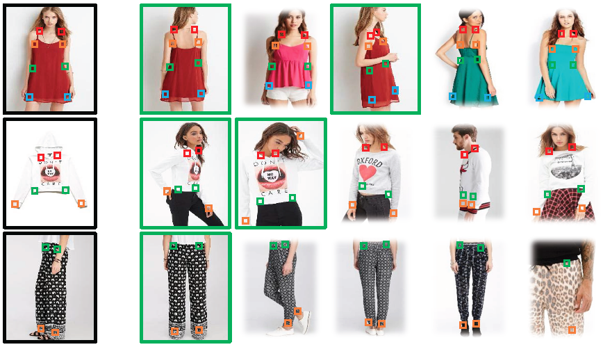

# ShopTheLook

What is Object Detection?
Object Detection is the task of identifying and locating objects in an image or video. It produces:

Class label (e.g., car, dog, person)

Bounding box (location of object in the image)

Real-world applications include:

Autonomous vehicles

Security surveillance

Medical imaging

Retail analytics

Industrial inspection


----------
##Implementation of Shop The look  adding Agentic RAG 

### Inspiration


### Milestone 1: Training Object detection modal to extract Fashion Part

### Dataset Information

[](https://paperswithcode.com/dataset/in-shop)

---

## 📦 DeepFashion: In-shop Clothes Retrieval Dataset

The **DeepFashion: In-shop Clothes Retrieval** dataset is a benchmark designed to evaluate the performance of in-shop clothes retrieval systems. It is a comprehensive subset of the larger DeepFashion database, focusing on images captured in controlled, shop-like environments.([mmlab.ie.cuhk.edu.hk][1], [mmlab.ie.cuhk.edu.hk][2])

### 🔍 Key Features

* **7,982** unique clothing items
* **52,712** in-shop clothing images
* Approximately **200,000** cross-pose/scale image pairs
* Rich annotations per image, including:

  * Bounding boxes
  * Clothing categories
  * Pose types

### 📁 Dataset Contents

* **In-shop Clothes Images**: High-quality images of clothing items.
* **High-Resolution Images**: Enhanced versions for detailed analysis.
* **Identity & Pair Annotations**: Mappings of clothing items and their corresponding pairs.
* **Bounding Box & Landmark Annotations**: Spatial information for object detection tasks.
* **Attribute Annotations**: Detailed descriptors of clothing attributes.
* **Parsing Mask Annotations**: Segmentation masks for fine-grained analysis.
* **Dense Pose Annotations**: Detailed pose information for each image.
* **Train/Validation/Test Partitions**: Predefined splits for model training and evaluation.([mmlab.ie.cuhk.edu.hk][2], [mmlab.ie.cuhk.edu.hk][1])

### 🔗 Access the Dataset

You can download the dataset and access more details from the official project page:
👉 [DeepFashion: In-shop Clothes Retrieval](https://mmlab.ie.cuhk.edu.hk/projects/DeepFashion/InShopRetrieval.html)

### 📄 Citation

If you utilize this dataset in your research or projects, please cite the following paper:

```bibtex
@inproceedings{liuLQWTcvpr16DeepFashion,
  author    = {Ziwei Liu and Ping Luo and Shi Qiu and Xiaogang Wang and Xiaoou Tang},
  title     = {DeepFashion: Powering Robust Clothes Recognition and Retrieval with Rich Annotations},
  booktitle = {Proceedings of IEEE Conference on Computer Vision and Pattern Recognition (CVPR)},
  month     = {June},
  year      = {2016}
}
```

Thanks for the clarification! Since you're using the **DeepFashion In-shop Clothes Retrieval** dataset primarily to train an **object detection model** — specifically for detecting fashion parts like **Topwear, Bottomwear, Shoes, Handbags, and Sunglasses** — and you’re extending it by adding **custom bounding box annotations**, your README should clearly reflect both:

* The original dataset's purpose and content
* Your modifications (e.g., added classes and annotations)

Here's the updated Markdown section tailored for your use case:

---

## 📦 DeepFashion In-shop Clothes Retrieval Dataset (Customized for Object Detection)

The **DeepFashion: In-shop Clothes Retrieval** dataset is originally designed for fine-grained clothing retrieval tasks. It contains high-resolution images of fashion items in controlled shop settings, with rich metadata such as category labels, clothing identities, and bounding boxes for some categories.

### 🔧 Our Custom Use Case

We adapt this dataset for training **fashion object detection models** aimed at localizing and classifying key fashion parts:

* **Topwear**
* **Bottomwear**
* **Shoes** *(custom annotated)*
* **Handbags** *(custom annotated)*
* **Sunglasses** *(custom annotated - in plan)* 

Since the original dataset lacks bounding box annotations for some of our target classes (e.g., shoes, handbags, sunglasses), we will add **custom bounding box annotations** to extend its applicability for object detection.

### 📁 Dataset Components (Customized)

* 🖼️ In-shop clothing images
* 🔲 Original bounding boxes for clothing items (from DeepFashion)
* ✍️ Custom bounding boxes for:

  * Shoes
  * Handbags
  * Sunglasses (in plan)
* 📌 Fashion part category labels: `Topwear`, `Bottomwear`, `Shoes`, `Handbags`, `Sunglasses`
* 🧪 Train/val/test splits for object detection tasks

---

<!-- [1]: https://mmlab.ie.cuhk.edu.hk/projects/DeepFashion/InShopRetrieval.html?utm_source=chatgpt.com "DeepFashion: In-shop Clothes Retrieval"
[2]: https://mmlab.ie.cuhk.edu.hk/projects/DeepFashion.html?utm_source=chatgpt.com "Large-scale Fashion (DeepFashion) Database" -->
